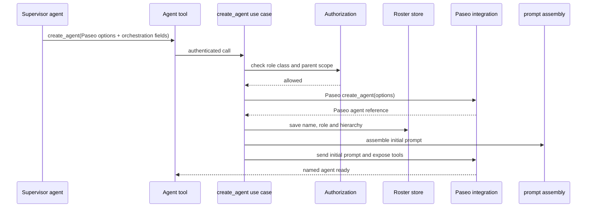
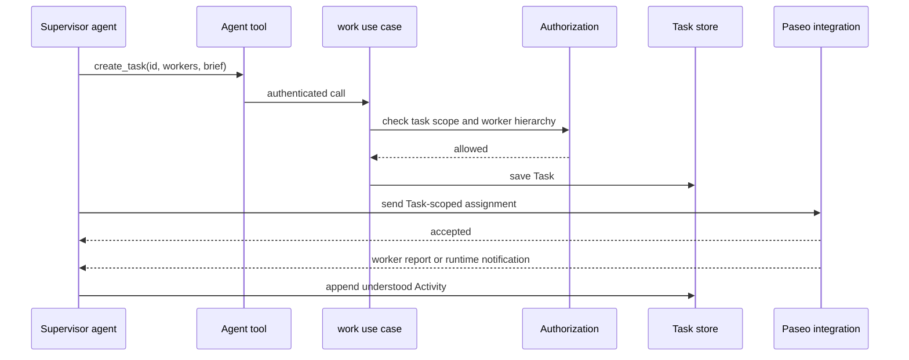
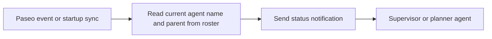

# 模块设计 v0

这一层把架构翻译成传统软件工程中的数据、存储、用例、外部接缝、调用路径和权限。模块先保持在一个 Paseo plugin 内；不提前拆成多个 package 或 workflow engine。

## 分层

```text
client UI / agent MCP tools
            │
            ▼
       use cases
   ┌────────┼─────────┐
   ▼        ▼         ▼
 roster   work     communication
   │        │         │
   └────────┴─────────┘
            │
            ▼
          stores
            │
   ┌────────┴─────────┐
   ▼                  ▼
prompt assembly   Paseo integration
                       │
                       ▼
          Paseo SDK / hooks
```

`stores` 是数据访问边界，不是对外的业务 API；use case 才是跨记录、鉴权和 Paseo 调用的业务入口。Roster、work 和 communication 是按用例分组的内部模块，不要求各自都成为独立 service。

### Persistence and domain modules

Plugin v0 使用一个版本化的 `state store` 保存 plugin-owned 数据：roster、Task、Activity、项目 schema 和 PWA source configuration。它负责完整文档的读取、校验、revision、原子写入、迁移和恢复，不调用 Paseo，也不决定谁能做什么。Paseo 的 host-scoped settings 已经提供了这组小型 JSON 文档需要的持久化语义，因此第一条切片优先用 `defineSettings`；数据量真的超过配置文档适合的范围时，再把同一接口换成 server-side 文件或 SQLite。

`roster`、`work` 和 `activity` 是在 state store 之上的领域模块：前者提供上下级和权限范围查询，`work` 处理 Task 与 agent 关系，后者处理 Activity 追加、回复关联和时间线查询。它们不是各自的持久服务。A2A 也不建立 communication store；发送直接走 Paseo，通知路由只复用 roster 查询。

### Use cases

Use case 负责一次完整操作：解析调用者、检查 role class 和范围、读写多个 store、调用 Paseo integration，并在需要时追加 Activity 或发送消息。

第一版对外操作分成查询、plugin 记录操作和 Paseo 原生能力。查询不改变事实，记录操作才写 plugin store：

```text
查询：
list_agents
get_agent
list_tasks
get_task
list_activities
read_pwa

plugin 记录操作：
create_agent
update_agent
retire_agent
create_task
update_task
append_activity
append_human_activity
```

最小输入输出约定如下：

| 操作                    | 必要输入                                                                                    | 结果                             |
| ----------------------- | ------------------------------------------------------------------------------------------- | -------------------------------- |
| `create_agent`          | Paseo 默认创建参数，`name`、`roleClass`、`role`；可选 aliases、上级 name、existing agent ID | roster agent 和 Paseo agent 引用 |
| `update_agent`          | name；aliases 或展示字段 patch                                                              | 更新后的 roster agent            |
| `retire_agent`          | name                                                                                        | 标记为 retired 的 roster agent   |
| `create_task`           | slug id、title、brief、supervisor                                                           | 新 Task，初始 status/data 可选   |
| `update_task`           | Task；title、brief、status 或 data patch                                                    | 更新后的 Task                    |
| `append_activity`       | Task、正文、结构化 data                                                                     | 新 Activity；worker 不允许调用   |
| `append_human_activity` | Task、正文、结构化 data                                                                     | 新 Activity，并通知 Task manager |

`Task.id` 和 agent name 都是可读 slug。`Task.status` 是字符串，PWA 声明其有效值和业务转移，plugin 保存和索引它们但不执行状态机。Activity 必须属于一个 Task，并记录 `actorName` 与 `actorKind`。正文以 Markdown 为主；其中的 `paseo-swarm://` link 在写入时派生为 canonical ref，指向具名 agent、Task、Workspace 或 Workspace-relative file。这样项目级的 PWA proposal、审阅意见或人类决定也有稳定的 Task 时间线归属，不需要另建全局 mailbox。

`create_agent` 的 Paseo 参数在“创建新 agent”和“绑定 existing agent ID”两种路径中保持同一套编排字段；两者是二选一。`reportsTo` 默认调用者，只有调用者的层级范围允许时才可指定其它上级。具体工作沿负责 agent 的 Paseo affiliation 得到执行环境。

Paseo-backed capabilities 是：

```text
create_workspace
send_message
```

这些是 UI 或 agent tools 可能调用的边界，不是必须对应同名类。Paseo-backed capabilities 由薄 integration 暴露，不写入 plugin store。Activity 回复是 `append_human_activity` 携带 reply metadata 的便利入口。`assemble_prompt` 是内部纯函数；Paseo runtime event 的接收、启动同步和向上通知也是内部协调流程，不是 agent 要调用的 `report_runtime_status`。相关操作可以共享一个小的 `work` 或 `coordination` 模块。

## 数据关系

```text
Project
├── PWA source ── current revision
├── Agents
│   ├── name / aliases
│   ├── roleClass / role
│   ├── reportsTo name
│   └── Paseo agent reference
├── Paseo Workspace view
│   └── derived from agent affiliation and hierarchy
└── Tasks
    ├── supervisor reference
    ├── configurable state and data
    ├── manager + worker names
    └── Activities
```

Task 的 workset 是动态查询：`managerName = current agent name`。Supervisor 的 Workspace 视图也是动态查询：读取自己和直接 workers 的 Paseo Workspace affiliation 并求并。一个 supervisor 可以管理多个 Task、使用多个 Workspace；Task 直接保存可读的 worker names。

Agent 的局部 `name` 在直属 manager 下唯一；跨作用域使用 `qualifiedName`，例如 `supervisor-a.worker`。`reportsTo`、Task、Activity 和消息路由保存 qualified name；局部 name 只在当前 manager 的子树中解析。Paseo ID 仍是 runtime 关联和未来真实 identity binding 的稳定键。

## Roster 与 Paseo integration

Plugin 的 `create_agent` 用例接受 Paseo 默认 `create_agent` 的参数，再增加最小的编排字段：canonical name、aliases、role class、role 和上级 name。新 agent 的 Paseo Workspace affiliation 由 Paseo 创建参数和运行事实决定，不复制成 roster access 列表。

`roleClass` 和 `role` 在创建时确定且不可通过 register/update 改变。普通调用沿固定层级创建：planner 创建 supervisor，supervisor 创建 worker；`reportsTo` 默认是调用者。worker 不能创建下级 agent。局部 name 的冲突检查发生在同一个 parent 下，qualified name 冲突检查发生在整个 project roster 内。

调用顺序是：



Paseo integration 的作用是隔离 Paseo SDK 类型、创建/发送/订阅语义和生命周期 hook。Agent-facing tools 通过 plugin 管理的 Streamable HTTP MCP endpoint 暴露；每个 agent 获得带不透明 capability token 的 endpoint URL，gateway 从 token 映射到 Paseo agent，再进入 use case 做 authorization。token credential 独立持久化，不进入 Task 或 roster 记录。这个路径不要求修改 Paseo provider，也不把请求正文或 agent 自报身份当作调用者身份；它只约束 plugin-owned operations，不等于限制了 Paseo 原生 agent tools，后者仍是 Paseo 的 provider/tool policy 问题。Integration 不负责 role class 权限，不写 Task 状态，也不发明另一套 agent 配置。它应保持很薄；如果一个调用点直接使用 SDK 更清楚，可以暂时直接使用，重复出现后再收拢。

创建时的静态职责说明可以进入 agent system prompt；运行中的 Task 和 Activity context 通过 Paseo message 注入。不要假设 `agent.session_open` 能替换已有 system prompt。

UI 侧直接使用 Paseo 提供的 client hooks 和 navigation；server 侧才需要这层 integration。

## Task 与 agent

`create_task` 写入一个使用可读 slug 的 Task。Task 直接保存 manager 和 worker names；supervisor 通过 Paseo 原生消息向 worker 派发具体工作，worker 报告结果和阻塞。Paseo runtime status 与 transcript 是运行事实，不复制为第二个工作对象。



重新分派、并行工作和重试都由 supervisor 通过 Task 的 worker names 与消息表达，不产生新的 plugin 工作实体。

## Activity 与人工交互

Activity 是追加记录，可以带 Markdown 正文、派生 ref、结构化 `data`、展示信息和一个需要人操作的 action。UI 将它渲染成进度条目、可导航引用、决策卡片或带输入的交互条目；人的回复追加新的 Activity，并通知 Task manager。未来 custom card 只扩展 renderer 和 typed view data，不改变 Markdown/ref 的基础内容语义。

待处理列表是对带有未完成 action 的 Activity 的查询投影。只有当未来需要跨 Task 的独立分派、期限或复杂履历时，才重新考虑独立记录。

## 通信与运行状态

Roster store 提供上下级查询；消息发送用例使用这个查询决定默认收件人，再调用 Paseo integration 投递。通信不解释正文，也不从消息送达推导 Task 完成。

Paseo 状态通知使用一条窄路径：



Paseo 已经拥有 runtime status；plugin 第一版不建立重复的 runtime projection。启动和重连时重新读取 Paseo 当前快照，事件处理只负责通知，supervisor 或 planner 再决定是否追加 Activity 或更新 Task。

## Role class permissions

权限只覆盖 plugin 自己的记录和 tools。它不是外部 provider、Git 或 CI 的 gate。

权限检查使用调用者的 roster 身份。role class 和 hierarchy 只给出粗粒度的 authorization allow；use case 还要检查 Task、Activity 等具体上下文。Agent-facing MCP 通过每个 agent 独立的 capability URL 识别调用者，再映射到 roster；请求正文和 agent 自报身份都不能替代这个身份。当前实现仍不限制 Paseo 原生 agent tools，原生工具权限由 Paseo 的 provider/tool policy 决定。

| 操作                            | planner          | supervisor           | worker                     |
| ------------------------------- | ---------------- | -------------------- | -------------------------- |
| 读取项目 roster、PWA、Task 总览 | 项目范围         | 项目范围内可见内容   | 自己相关内容               |
| 创建 supervisor agent           | 可以             | 不可以               | 不可以                     |
| 创建 worker agent               | 项目范围内可以   | 自己管理范围内可以   | 不可以                     |
| 创建 Workspace                  | 可以             | 可以                 | 不可以                     |
| 创建 Task                       | 项目范围         | 自己管理范围内可以   | 可提出，不能取得管理权     |
| 修改 Task 看板字段              | 项目范围         | 自己管理的 Task      | 不可以                     |
| 追加 Activity                   | 可以             | 自己管理的 Task      | 不允许                     |
| 发送 Task 报告                  | 可联系项目参与者 | 可联系上下级及协作者 | 可发送给 manager           |
| 发送 A2A 消息                   | 可联系项目参与者 | 可联系上下级及协作者 | 默认联系上级及 Task 相关者 |
| 启用 PWA 版本                   | 由人类授权后执行 | 不可以               | 不可以                     |

人类 UI 作为项目管理员可以执行项目级操作。具体调用仍通过同一套 use case，避免 UI 绕过记录和权限检查。role 只影响上下文和业务说明，不改变 role class 的基础权限。

## 初始代码形状

遵循 Paseo plugin 的 `shared / server / client` 边界：

```text
shared/
  models.ts          记录和 RPC/MCP schema
  operations.ts      tool/RPC contracts

server/
  state.ts
  roster.ts
  work.ts
  activity.ts
  use-cases/
    create-agent.ts
    work.ts
    communication.ts
  prompt.ts
  pwa-source.ts
  notifications.ts
  paseo.ts
  index.ts

client/
  project-screen.tsx
  workspace-panel.tsx
  task-screen.tsx
  pwa-screen.tsx
  navigation.ts
  index.tsx
```

`prompt.ts` 是纯 prompt 拼装函数，不是状态服务。`pwa-source.ts` 负责固定 source location 的读取和当前 revision 解析，不保存 PWA 正文。`paseo.ts` 是很薄的 SDK integration，不是权限层。`state.ts` 是唯一的 plugin-owned persistence adapter；v0 用 Paseo settings，后续更换存储后不改变领域模块和 use case。

Paseo timeline 的 plugin rows 只做 UI 投影，不是 Task 或 Activity 的权威存储；持久记录由 server-side store 保存，client 通过 RPC 查询。后续若加入 custom renderer，也只改变展示，不改变记录模型。
